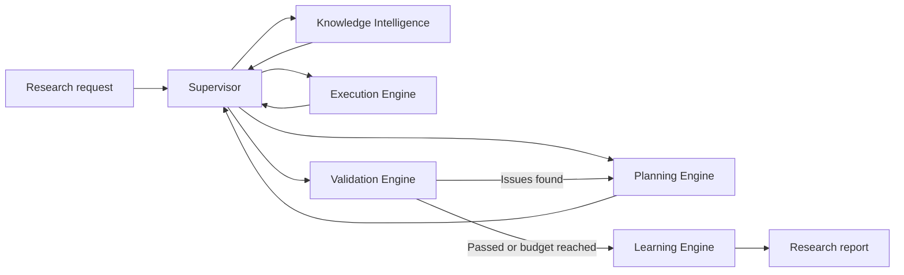

# RIOS — Research Intelligence Operating System

**An experimental AI research workspace that turns a natural-language research question into a supervised, evidence-oriented workflow.**

RIOS retrieves relevant academic papers, drafts a structured research plan, generates and runs small Python experiments, validates the resulting artifacts against explicit checks, and revises the plan when validation surfaces a missing requirement. It ships as both a command-line tool and an interactive [Chainlit](https://chainlit.io) application with live phase updates and downloadable Markdown reports.

> [!IMPORTANT]
> RIOS is a research prototype, not a production system. Several non-Python actions and evaluation metrics are currently simulated (see [Current Limitations](#current-limitations)), and any generated code should be treated as untrusted output, not vetted production code.

---

## Table of Contents

- [Why RIOS](#why-rios)
- [How It Works](#how-it-works)
- [Research Pipeline](#research-pipeline)
- [Installation](#installation)
- [Configuration](#configuration)
- [Usage](#usage)
- [Project Structure](#project-structure)
- [Technology Stack](#technology-stack)
- [Reliability and Safety Measures](#reliability-and-safety-measures)
- [Current Limitations](#current-limitations)
- [Roadmap](#roadmap)
- [Testing](#testing)
- [Contributing](#contributing)
- [License](#license)

---

## Why RIOS

Most "AI research assistant" demos stop at summarizing papers or drafting an outline. RIOS instead treats a research request as a **stateful, self-correcting workflow**: it plans concrete steps, executes the ones it can (short Python experiments), checks the results against rule-based validation criteria, and loops back to replanning when something is missing — bounded by a configurable correction budget so it can't run forever.

It's built as a platform for exploring **stateful AI agents, automated research workflows, and feedback-driven LLM orchestration**, not as a drop-in replacement for a human researcher.

## How It Works

RIOS represents each research run as a shared, typed state (`ResearchState`) and routes it through five specialized engines via a [LangGraph](https://github.com/langchain-ai/langgraph) supervisor:



**Normal path:**

```
Request → Knowledge → Planning → Execution → Validation → Learning
```

**On validation failure:**

```
Validation Failure → Feedback → Replanning → Re-execution
```

The correction loop is bounded by a configured maximum, `I_max`. RIOS keeps replanning while validation hasn't passed **and** the iteration count is under that budget; once either condition flips, it moves on to the Learning phase regardless of outcome.

The shared `ResearchState` carries the original request, an optional clarified brief, retrieved papers, the current plan, generated artifacts, feedback, validation results, stored memories, reasoning traces, and supervisor events across every step of the graph.

## Research Pipeline

| Phase | Responsibility |
|---|---|
| **Knowledge** | Searches arXiv and returns structured paper metadata. |
| **Planning** | Uses an LLM to produce a 3–5 step executable research plan. |
| **Execution** | Generates Python for supported steps and records code, status, stdout, and stderr. |
| **Validation** | Applies explicit rule-based checks to accumulated artifacts and returns actionable issues. |
| **Learning** | Stores a compact lesson from the completed validation cycle. |

## Installation

**Requirements:** Python 3.11+

```bash
git clone https://github.com/YOUR_USERNAME/rios.git
cd rios
python -m venv .venv
```

Activate the virtual environment:

```bash
# Linux / macOS
source .venv/bin/activate

# Windows PowerShell
.\.venv\Scripts\Activate.ps1
```

Install the package:

```bash
python -m pip install --upgrade pip
pip install -e .
```

For development (linting, tests):

```bash
pip install -e ".[dev]"
```

## Configuration

Groq is the default LLM provider. Copy the example environment file and add your key:

```bash
cp .env.example .env
```

```dotenv
GROQ_API_KEY=your_api_key_here
```

To use a different provider, set `LLM_PROVIDER` along with the matching key:

```dotenv
# OpenAI
LLM_PROVIDER=openai
OPENAI_API_KEY=your_api_key_here

# Anthropic
LLM_PROVIDER=anthropic
ANTHROPIC_API_KEY=your_api_key_here

# Local Ollama (no API key needed)
LLM_PROVIDER=ollama
```

> Never commit `.env` or any API key. The repository's `.gitignore` already excludes local secret files — double-check before your first commit.

## Usage

### Interactive workspace

```bash
rios chat --host 127.0.0.1 --port 8000
```

Open `http://127.0.0.1:8000` and submit a research question. From the UI you can configure reasoning-trace display, clarification questions, the LLM provider, the number of papers retrieved, and the maximum self-correction iterations.

### Retrieve academic papers

```bash
rios knowledge "retrieval-augmented generation for medical question answering" --top-k 5
```

### Generate a research plan

```bash
rios plan "quantum machine learning for image classification" --top-k 5
```

### Run the complete pipeline

```bash
rios run "deepfake detection using quantum methods" --iterations 2 --top-k 5
```

### Generated reports

The Chainlit interface can export a Markdown report containing the original task and clarified brief, retrieved academic sources, the final plan, generated Python and its execution output, validation results, consolidated lessons, and per-phase timings.

## Project Structure

```text
RIOS/
├── rios/
│   ├── core/
│   │   ├── state.py          # Shared typed research state
│   │   └── supervisor.py     # LangGraph routing and correction loop
│   ├── tools/
│   │   ├── arxiv_tool.py     # Cached arXiv API integration
│   │   ├── llm_tool.py       # Multi-provider LLM adapter
│   │   └── python_sandbox.py # Bounded subprocess execution
│   ├── engines.py            # Research engine implementations
│   ├── cli.py                # Command-line interface
│   └── chat.py                # Chainlit application
├── tests/
│   └── test_supervisor.py
├── pyproject.toml
└── README.md
```

## Technology Stack

- **Python 3.11+**
- **LangGraph** — stateful orchestration and checkpointing
- **Chainlit** — interactive research workspace UI
- **OpenAI-compatible SDK** — Groq, OpenAI, and Ollama providers
- **Anthropic SDK** — when Anthropic is selected as the provider
- **arXiv Atom API** — literature retrieval
- **AsyncIO** — non-blocking application behavior
- **Pytest** — offline contract and pipeline tests

## Reliability and Safety Measures

- arXiv requests use bounded retries, backoff, timeouts, and a 24-hour cache.
- LLM JSON responses are extracted defensively and retried once if malformed.
- Research correction loops are capped by a configurable iteration budget.
- Python subprocesses run with a default five-second timeout and bounded captured output.
- Interactive runs have an overall timeout to prevent indefinitely hanging tasks.
- Concurrent research runs are blocked within the same UI session.

## Current Limitations

Being upfront about what RIOS doesn't do yet:

- **No OS-level sandboxing.** The Python runner is a lightweight subprocess wrapper, not a security boundary — run RIOS only in an isolated, trusted development environment.
- **Standard-library only.** Generated experiments use the Python standard library and may simulate data or results rather than using real datasets.
- **Non-Python steps are placeholders.** Plan steps assigned to tools other than Python are represented by placeholder artifacts, not real executions.
- **Narrow validation.** The current validator checks a limited set of rule-based criteria rather than performing genuine scientific review.
- **No cross-session memory.** Episodic memory lives in the run state and isn't yet a persistent, cross-session knowledge base.
- **Basic retrieval.** arXiv keyword retrieval doesn't currently include reranking, citation analysis, or full-text processing.

## Roadmap

- [ ] Replace placeholder tool actions with real dataset, repository, and container integrations.
- [ ] Add stronger isolation for generated-code execution.
- [ ] Introduce evidence-grounded, LLM-assisted validation rubrics.
- [ ] Add persistent vector and episodic memory across research sessions.
- [ ] Support full-text retrieval, citation graphs, deduplication, and semantic reranking.
- [ ] Expand automated tests for asynchronous engines, failure paths, and UI behavior.

## Testing

```bash
pytest -q
```

Tests use a fake arXiv implementation so retrieval contracts can be verified without live network access.

## Contributing

This is an experimental, actively evolving project. Issues and pull requests are welcome — please open an issue first for anything beyond a small fix so the approach can be discussed before significant work goes in.

## License

No license has been selected yet. Add one (MIT or Apache-2.0 are common choices for projects like this) before inviting external reuse or contributions.

## Author

Developed as an experimental platform for exploring stateful AI agents, automated research workflows, and feedback-driven LLM orchestration.
