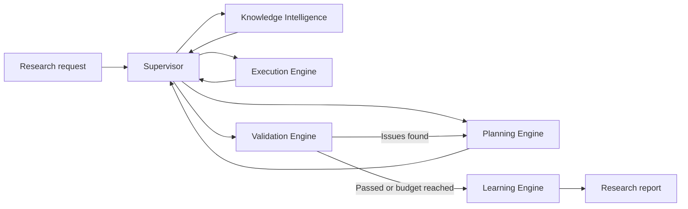

# RIOS — Research Intelligence Operating System

RIOS is an experimental AI research workspace that converts a natural-language research request into a supervised, evidence-oriented workflow. It retrieves relevant academic papers, creates a structured research plan, generates and executes small Python experiments, validates the resulting artifacts, and revises the plan when validation identifies a missing requirement.

The project provides both a command-line interface and an interactive Chainlit application with live phase updates, configurable research settings, execution output, timing information, and downloadable Markdown reports.

> [!IMPORTANT]
> RIOS is a research prototype. Some non-Python actions and evaluation metrics are currently simulated, and generated code must not be treated as trusted production code.

## Highlights

- Stateful research orchestration built with LangGraph.
- Real academic-paper retrieval through the arXiv API.
- Structured LLM-generated plans with JSON validation and retry handling.
- Feedback-driven replanning and bounded self-correction loops.
- Local subprocess execution for short, standard-library Python experiments.
- Support for Groq, OpenAI, Anthropic, and local Ollama models.
- Interactive Chainlit UI with clarification questions and live progress.
- CLI commands for retrieval, planning, complete runs, and UI launch.
- Session checkpointing, execution traces, phase timings, and report export.
- Cached arXiv results with retry, backoff, timeout, and error handling.

## System Architecture

RIOS represents each research run as a shared typed state and routes it through five specialized engines:



The normal transition sequence is

$$
\text{Request} \rightarrow \text{Knowledge} \rightarrow \text{Planning}
\rightarrow \text{Execution} \rightarrow \text{Validation}
\rightarrow \text{Learning}.
$$

If validation fails, RIOS adds the reported issues to the shared state and returns to planning:

$$
\text{Validation Failure} \rightarrow \text{Feedback} \rightarrow
\text{Replanning} \rightarrow \text{Re-execution}.
$$

The loop is bounded by the configured correction budget $I_{\max}$:

$$
\text{continue correction} = \neg \text{passed} \land I < I_{\max}.
$$

## Research Pipeline

| Phase | Responsibility |
|---|---|
| Knowledge | Searches arXiv and returns structured paper metadata. |
| Planning | Uses an LLM to produce a three-to-five-step executable research plan. |
| Execution | Generates Python for supported steps and records code, status, stdout, and stderr. |
| Validation | Applies explicit checks to the accumulated artifacts and returns actionable issues. |
| Learning | Stores a compact lesson from the completed validation cycle. |

The shared `ResearchState` carries the request, optional brief, papers, current plan, artifacts, feedback, validation results, memories, reasoning traces, and supervisor events throughout the graph.

## Technology Stack

- Python 3.11+
- LangGraph for stateful orchestration and checkpointing
- Chainlit for the interactive research workspace
- OpenAI-compatible SDK for Groq, OpenAI, and Ollama
- Anthropic SDK support when selected
- arXiv Atom API for literature retrieval
- AsyncIO for non-blocking application behavior
- Pytest for offline contract and pipeline tests

## Project Structure

```text
RIOS/
├── rios/
│   ├── core/
│   │   ├── state.py          # Shared typed research state
│   │   └── supervisor.py     # LangGraph routing and correction loop
│   ├── tools/
│   │   ├── arxiv_tool.py     # Cached arXiv API integration
│   │   ├── llm_tool.py       # Multi-provider LLM adapter
│   │   └── python_sandbox.py # Bounded subprocess execution
│   ├── engines.py            # Research engine implementations
│   ├── cli.py                # Command-line interface
│   └── chat.py               # Chainlit application
├── tests/
│   └── test_supervisor.py
├── pyproject.toml
└── README.md
```

## Installation

Clone the repository and create a virtual environment:

```bash
git clone https://github.com/YOUR_USERNAME/rios.git
cd rios
python -m venv .venv
```

Activate it on Windows PowerShell:

```powershell
.\.venv\Scripts\Activate.ps1
```

Or on Linux and macOS:

```bash
source .venv/bin/activate
```

Install the package:

```bash
python -m pip install --upgrade pip
pip install -e .
```

For development and tests:

```bash
pip install -e ".[dev]"
```

## Configuration

Groq is the default provider. Copy `.env.example` to `.env`, then add your key:

```dotenv
GROQ_API_KEY=your_api_key_here
```

Alternative providers can use the following environment variables:

```dotenv
LLM_PROVIDER=openai
OPENAI_API_KEY=your_api_key_here

# Or:
# LLM_PROVIDER=anthropic
# ANTHROPIC_API_KEY=your_api_key_here

# Or run Ollama locally:
# LLM_PROVIDER=ollama
```

Never commit `.env` or an API key. The included `.gitignore` excludes local secret files.

## Usage

### Interactive workspace

```bash
rios chat --host 127.0.0.1 --port 8000
```

Open `http://127.0.0.1:8000` and submit a research question. The UI allows you to configure reasoning display, clarification questions, the LLM provider, the number of papers retrieved, and the maximum self-correction iterations.

### Retrieve academic papers

```bash
rios knowledge "retrieval-augmented generation for medical question answering" --top-k 5
```

### Generate a research plan

```bash
rios plan "quantum machine learning for image classification" --top-k 5
```

### Run the complete pipeline

```bash
rios run "deepfake detection using quantum methods" --iterations 2 --top-k 5
```

### Run tests

```bash
pytest -q
```

The tests use a fake arXiv implementation so retrieval contracts can be checked without live network access.

## Generated Report

The Chainlit interface can produce a Markdown report containing the original task and clarified brief, academic sources, final plan, generated Python and execution output, validation results, consolidated lessons, and per-phase timings.

## Reliability and Safety Measures

- arXiv requests use bounded retries, backoff, timeouts, and a 24-hour cache.
- LLM JSON responses are extracted defensively and retried once if invalid.
- Research correction loops are limited by a configurable iteration budget.
- Python processes have a default five-second timeout and bounded captured output.
- The interactive run has an overall timeout to prevent indefinitely running tasks.
- Concurrent research runs are blocked within the same UI session.

## Current Limitations

- The Python runner is a lightweight subprocess wrapper, not an operating-system security boundary. Run RIOS only in an isolated, trusted development environment.
- Generated experiments use the Python standard library and may simulate data or results.
- Plan steps assigned to tools other than Python are represented by placeholder artifacts.
- The current validator checks a narrow rule-based criterion rather than performing a comprehensive scientific review.
- Episodic memory is stored in the run state and is not yet a persistent cross-session knowledge base.
- arXiv keyword retrieval does not currently include reranking, citation analysis, or full-text processing.

## Roadmap

- Replace placeholder tool actions with real dataset, repository, and container integrations.
- Add stronger isolation for generated-code execution.
- Introduce evidence-grounded and LLM-assisted validation rubrics.
- Add persistent vector and episodic memory across research sessions.
- Support full-text retrieval, citation graphs, deduplication, and semantic reranking.
- Expand automated tests for asynchronous engines, failure paths, and UI behavior.

## License

No license has been selected yet. Add one before inviting external reuse or contributions. MIT or Apache-2.0 may be appropriate for an open-source release, depending on your goals.

## Author

Developed as an experimental platform for exploring stateful AI agents, automated research workflows, and feedback-driven LLM orchestration.
